# Convolutional neural network
## Vấn đề của fully connected neural network
### Vấn đề thứ nhất
- Giả sử  có 1 ảnh màu 64x64 được biểu thị dưới dạng tensor 64x64x3. Để biếu thị hết nội dung của bức ảnh vào input layer tất cả các pixel cần có 122288 nodes
- 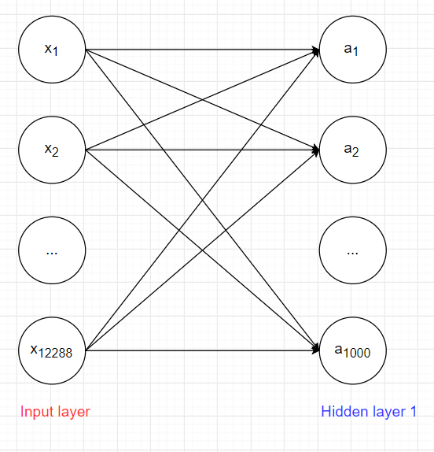
- Giả sử số lượng nodetrong hidden layer 1 là 1000. Số lượng weight W giữa input layer 1 và hidden layer 1 là 122888000 số lượng bias là 1000 -> tổng parameter là 12289000. Trong 1 model có nhiều layer thì số lượng parameter tăng rất nhanh
### Vấn đề thứ 2
- Giả sử input là ảnh 28x28 khi flatten thành 1 vector 1 chiều trước khi đưa vào mạng nơ-ron. Điều này sẽ dẫn đến toàn bộ cấu trúc không gian 2 chiều giữa các pixel láng giềng sẽ bị mất đi. Khi vật thể di chuyển thay đổi vị trí trong ảnh(con vật quay sang trái quay sang phải, ...) model sẽ dự đoán sai
- ví dụ: Nếu một vật thể di chuyển trong ảnh, nhưng pixel sau khi flatten bị trộn lẫn, mạng fully connected sẽ gặp khó khăn trong việc học cách nhận diện vật thể ở những vị trí khác nhau.
- 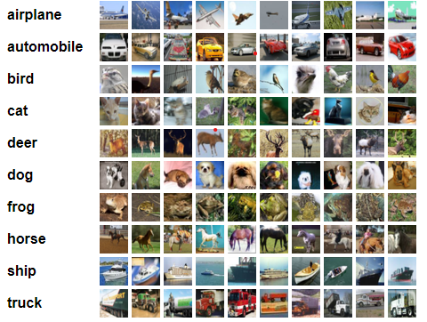
## Convolutional Layer
- Áp dụng phép tính convolution vào layer trong neural network ta có thể giải quyết được vấn đề lượng lớn parameter mà vẫn lấy ra được các đặc trưng của ảnh.
- 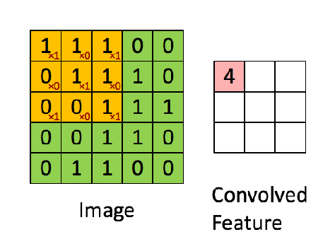
- Ảnh màu có tới 3 channels red, green, blue nên khi biểu diễn ảnh dưới dạng tensor 3 chiều. Nên ta cũng sẽ định nghĩa kernel là 1 tensor 3 chiều kích thước k*k*3.
- 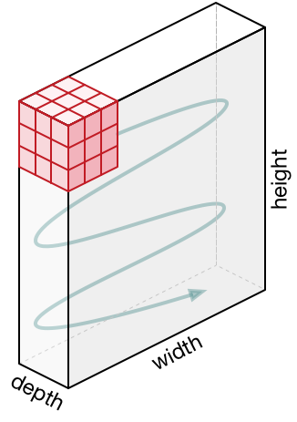
-  kernel có cùng độ sâu (depth) với biểu diễn ảnh, rồi sau đó thực hiện di chuyển khối kernel tương tự như khi thực hiện trên ảnh xám.
- 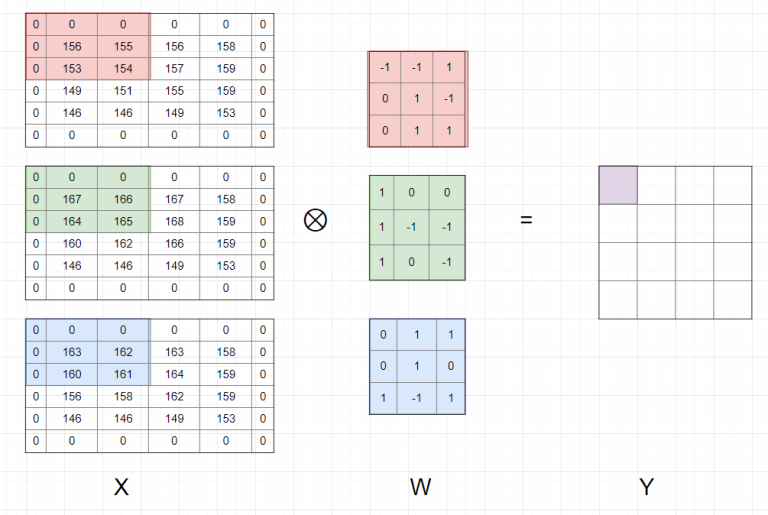
- Thực hiện phép tính convolution trên ảnh màu
- 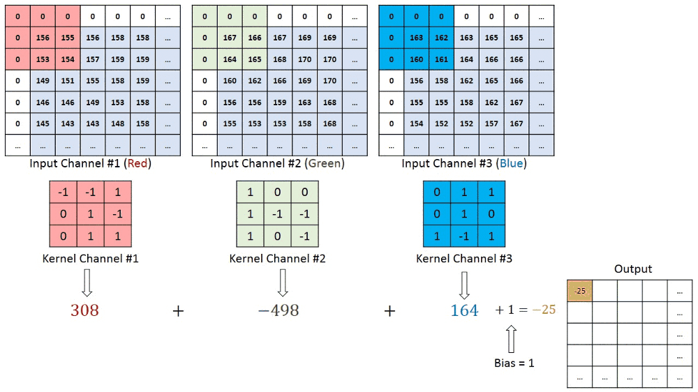
- Nhận xét:
   - Output Y của phép tính convolution trên ảnh màu là 1 matrix.
   - Có 1 hệ số bias được cộng vào sau bước tính tổng các phần tử của phép tính element-wise
### Padding and Stride
- Với mỗi kernel khác nhau ta sẽ học được những đặc trưng khác nhau của ảnh, nên trong mỗi convolutional layer ta sẽ dùng nhiều kernel để học được nhiều thuộc tính của ảnh. Vì mỗi kernel cho ra output là 1 matrix nên k kernel sẽ cho ra k output matrix
- 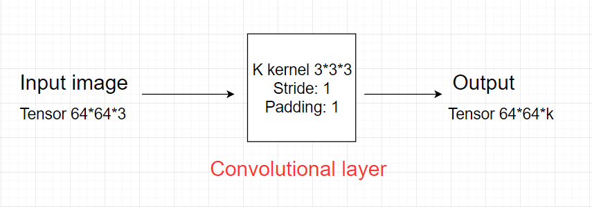
### Convolutional layer tổng quát
- Giả sử input của 1 convolutional layer tổng quát là tensor kích thước H * W * D.
- Kernel có kích thước F * F * D (kernel luôn có depth bằng depth của input và F là số lẻ), stride: S, padding: P.
- Convolutional layer áp dụng K kernel.
- 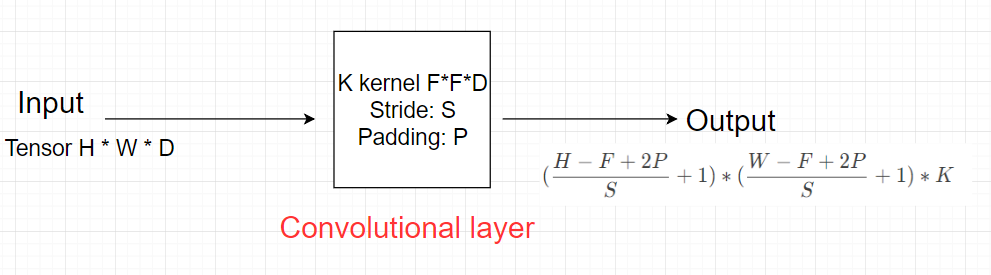
- Output của convolutional layer sẽ qua hàm activation function trước khi trở thành input của convolutional layer tiếp theo
- Tổng số parameter của layer: Mỗi kernel có kích thước F*F*D và có 1 hệ số bias, nên tổng parameter của 1 kernel là F*F*D + 1. Mà convolutional layer áp dụng K kernel => Tổng số parameter trong layer này là K * (F*F*D + 1).
## Pooling layer
- Pooling layer thường được dùng giữa các convolutional layer, để giảm kích thước dữ liệu nhưng vẫn giữ được các thuộc tính quan trọng. Kích thước dữ liệu giảm giúp giảm việc tính toán trong model.
- 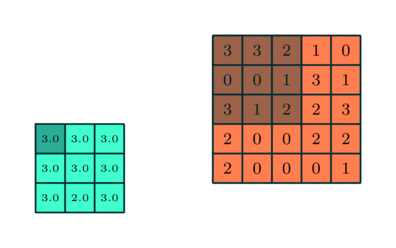
- Nhưng hầu hết khi dùng pooling layer thì sẽ dùng size=(2,2), stride=2, padding=0. Khi đó output width và height của dữ liệu giảm đi một nửa, depth thì được giữ nguyên
- 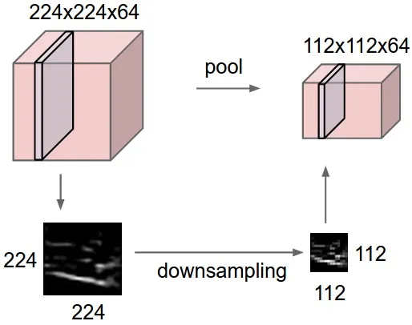
- Có 2 loại pooling layer phổ biến là: max pooling và average pooling.
- 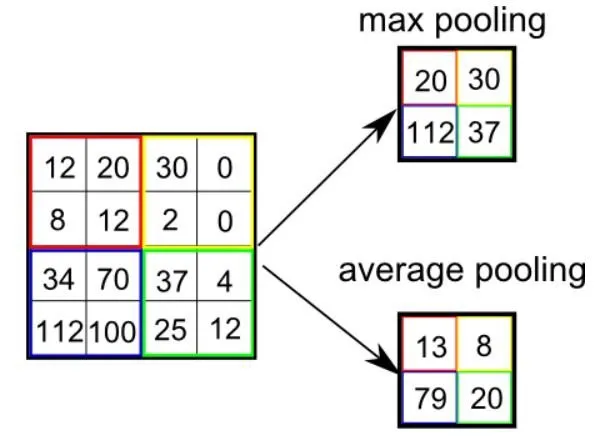
## Fully connected layer
- 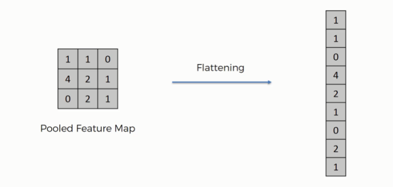
## Visualise convolutional neural network
- 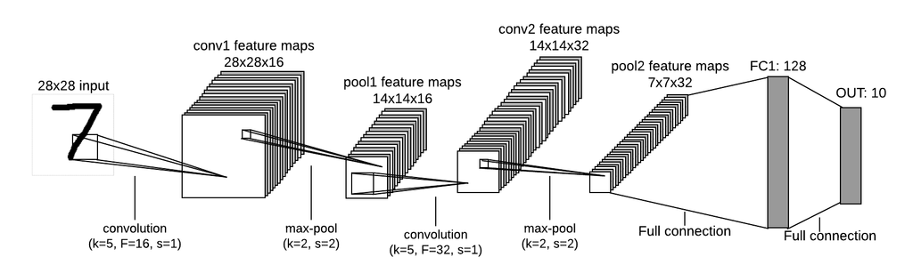
