# Classification
## Introduce
- The variable 𝑦 that you want to predict (the output variable) is discrete(hữu hạn).
- Examples(with two classes): Email: Spam / Not Spam?
• We will first start talking about **binary classification** (with two classes).
• Then, we will talk more about **multi-class classification** (with more than two classes), 𝑦 ∈ {0, 1, 2, 3, … , 𝑐}
## Linear Classification with Logistic Regression
- This is a classification method
- In a binary classification, we want 𝑦 = 0 or 𝑦 = 1
- But, if you use a simple linear regression model ℎ_𝜃(𝑥) = $\theta^Tx $, then $ℎ_𝜃$(𝑥) can be > 1 or < 0
- The logistic regression model is defined so that 0 ≤ $ℎ_𝜃$(𝑥) ≤ 1
-$ℎ_\theta$ (x) = 𝑔($\theta^Tx $), where 𝑔𝑔(. ) is the $sigmoid function$ (or logistic
function)
- Sigmoid function: $h_\theta(x) = \frac{1}{1 + e^{-\theta^T x}}$
- 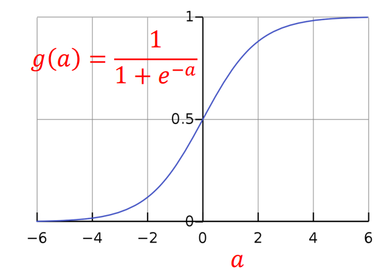
- $h_\theta(x) = g(\theta^Tx) = P(y=1|x, \theta)$

- $g(a) = \frac{1}{1+e^{-a}}$
- if $ℎ_𝜃$(𝑥) ≥ 0.5 then we predict class y = 1
- if $ℎ_𝜃$(𝑥)< 0.5 then we predict class y = 0
- The same as:
- if $ℎ_𝜃$(𝑥) ≥ 0 then we predict class y = 1
- if $ℎ_𝜃$(𝑥) < 0 then we predict class y = 0
- 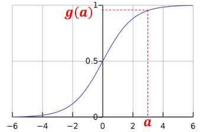
- 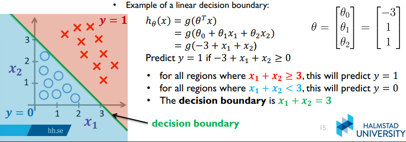
## Defining the Cost Function for Logistic Regression
- 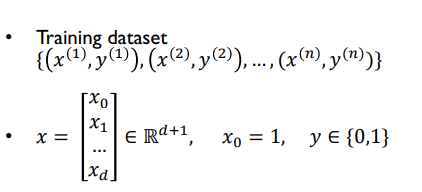
- 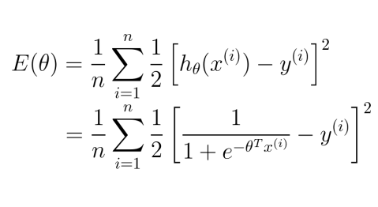
- 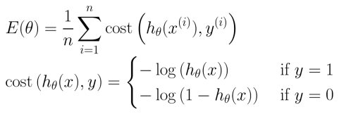 
- If 𝑦 = 1
- 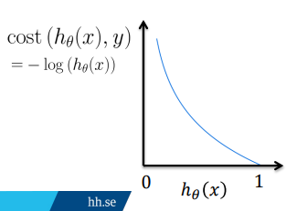
- When ℎ𝜃 𝑥 is closer to 1, the 𝑐ost($ℎ_\theta(𝑥)$ , 𝑦) is closer to 0
- The 𝑐ost($ℎ_\theta(𝑥)$ , 𝑦) = 0 if $h_\theta(x)$= 1
- As $h_\theta(x) \rightarrow 0$, the $c \rightarrow \infty$
- If $h_\theta(x) = 0$ (i.e., $P(y=1|x, \theta) = 0$), but $y=1$, then we will penalize the learning algorithm by a very large cost.
- If 𝑦 = 0 
- 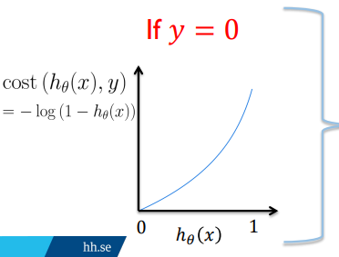
- When $h_\theta(x)$ is closer to 0, the $c(h_\theta(x), y)$ is closer to 0. 
- The cost $c(h_\theta(x), y) = 0$ if $h_\theta(x) = 0$
- As $h_\theta(x) \rightarrow 1$, the $c \rightarrow \infty$
- If $h_\theta(x) = 1$ (i.e., $P(y=0|x, \theta) = 0$), but $y=0$, then we will penalize the learning algorithm by a very large cost.
- 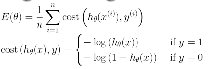
- 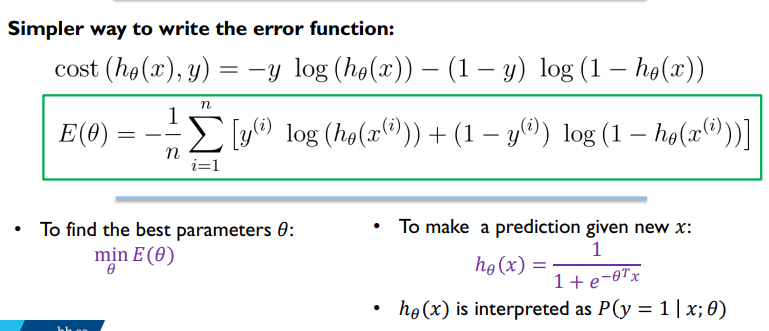
## Gradient of the Cost Function
- 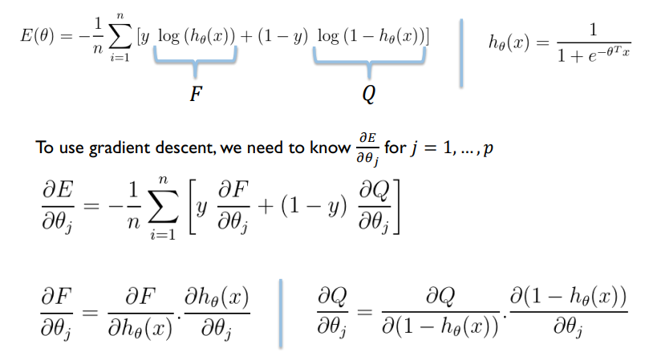
- 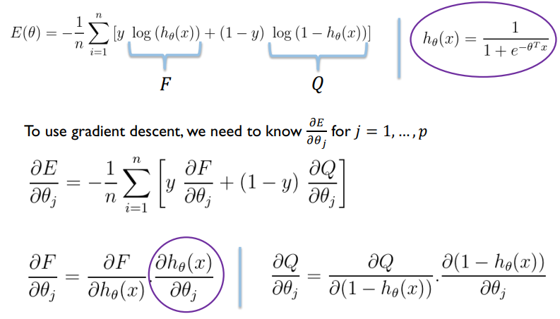
- 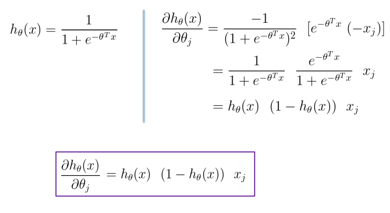
- 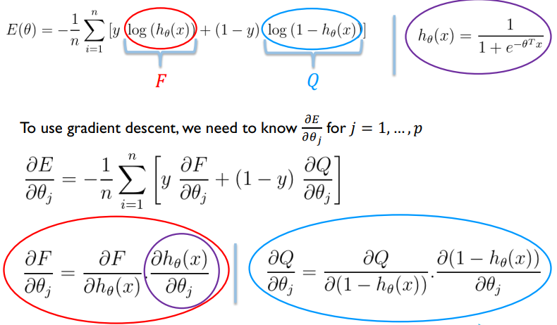
- 
## Gradient Descent for the Logistic Regression Classifier
- 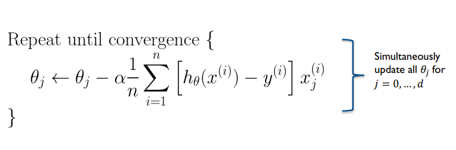\
- • Looks identical to linear regression!
• But here in logistic regression $h_\theta(x) = \frac{1}{1 + e^{-\theta^T x}}$
instead of ℎ_𝜃(𝑥) =$𝜃^𝑇$𝑥 which was used in linear regression.
## Can We Use Logistic Regression for Multi-class Classification
- 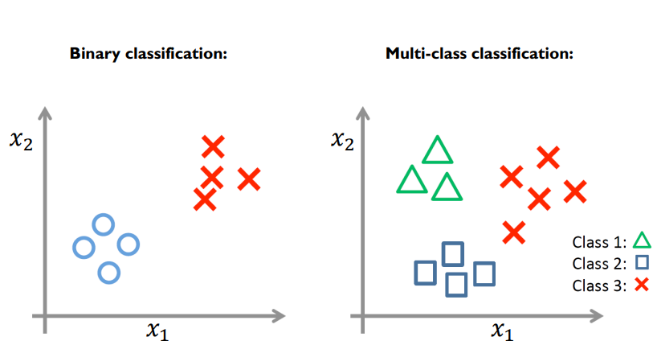
- 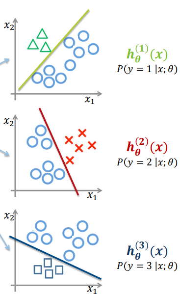
- Train a logistic regression classifier ${ℎ_𝜃}^{(𝑖)}$ =(𝑥) for each class 𝑖 topredict the probability that 𝑦 = i
- $h_{\theta_i}^{(i)}(x) = P(y = i | x; \theta), \quad i = 1, 2, 3$
- To make a prediction on a new input $x$, pick the class that maximizes the probability: $\max_i h_{\theta_i}(x)$
- **One-vs-all (one-vs-rest)**: Train one binary classification model for each class (vs all the other classes)
- **One-vs-one**: You can also train one binary classification model for each pair of classes
## Nonlinear Classification
### Non-linear classification with Logistic Regression
- $h_\theta(x) = g(\theta^Tx) = g(\theta_0 + \theta_1x_1 + \theta_2x_2 + \theta_3x_1^2 + \theta_4x_2^2)$

$ = g(-1 + x_1^2 + x_2^2)$

- Predict $y = 1$ nếu $x_1^2 + x_2^2 \geq 1$
- 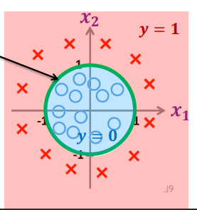
### More complex non-linear decision boundary
- 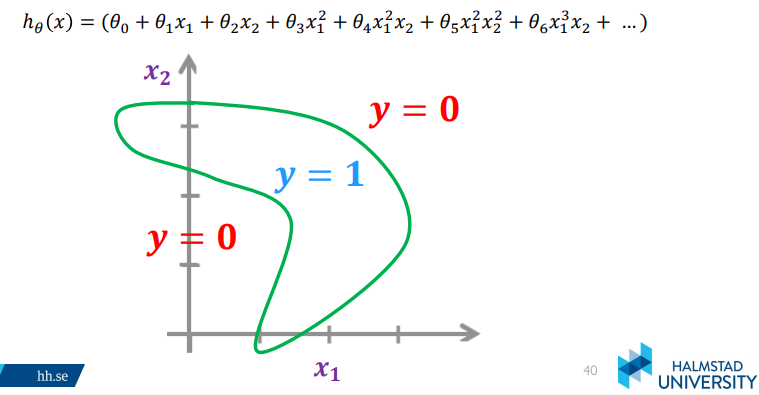

### The K Nearest Neighbors Classifier KNN
- Simple method that does not require learning
- For each test data-point x, to be classified, find the K nearest points in the training 
data.
- Classify the point x, according to the majority(đa số) vote of their class label
- 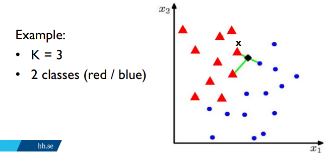
- 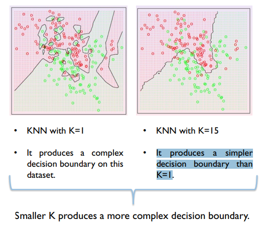
## Decision Tree Classifier
- **Build the Tree**
- For each node, find the feature F + threshold(gia tri nguong) value T
- Split the samples assigned to the node into 2 subsets
- So as to maximize the label purity(tinh khiết) within these subsets(tập con).
- 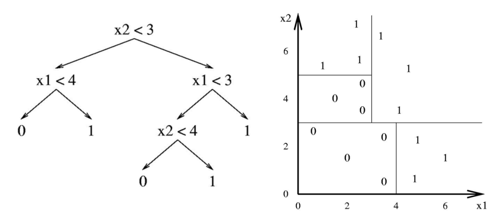

