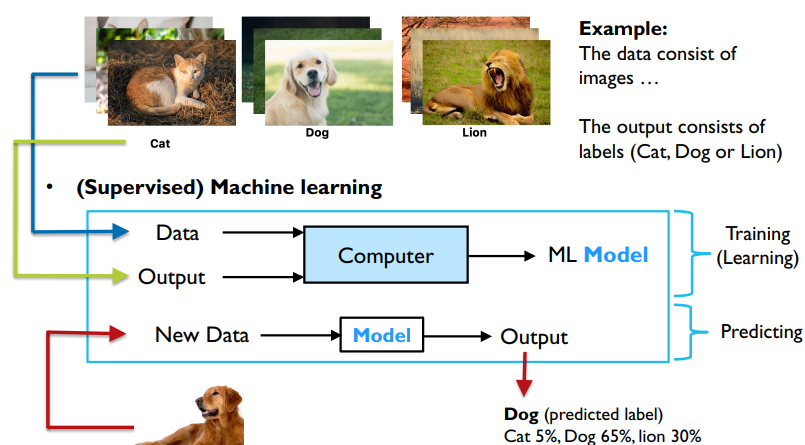
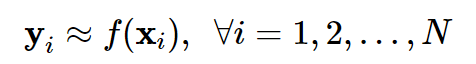

# Machine Learning là gì
- **Machine Learning**: Field of study that gives computers the
ability to learn without being explicitly programmed with rules.
- **Machine learning algorithms** build a **model** (mô hình) from the training data, then uses this model to make **predictions**(dự đoán) or **decisions** (quyết định) without being explicitly(rõ ràng) programmed to perform the task.

Example:

# Phân loại Machine Learning
- **Supervised Learning (Học có giám sát)**
- **Unsupervised Learning (Học không giám sát)**
- **Semi-Supervised Learning (Học bán giám sát)**
- **Reinforcement Learning (Học củng cố)**
- **etc...**
## Supervised Learning
- **Supervised learning** là thuật toán dự đoán đầu ra (outcome) của một dữ liệu mới (new input) dựa trên các cặp (input, outcome) đã biết từ trước. Cặp dữ liệu này còn được gọi là (data, label), tức (dữ liệu, nhãn).
- Supervised learning là khi chúng ra có một tập hợp biến đầu vào X={x1,x2,…,xN} và một tập hợp nhãn tương ứng Y={y1,y2,…,yN}. Các cặp dữ liệu biết trước **(xi,yi) ∈ X×Y** được gọi là tập **training data**.  Từ tập training data này, chúng ta cần tạo ra một hàm số ánh xạ mỗi phần tử từ tập X sang một phần tử (xấp xỉ) tương ứng của tập Y:

- Mục đích là xấp xỉ hàm số f thật tốt để khi có một dữ liệu x mới, chúng ta có thể tính được nhãn tương ứng của nó y=f(x).
### Phân loại thuật toán Supervised Learning
- **Classification(Phân loại)**:Một bài toán được gọi là classification nếu các label của input data được chia thành một số hữu hạn nhóm. Ví dụ: Gmail xác định xem một email có phải là spam hay không
- **Regression (Hồi quy)**: Nếu label không được chia thành các nhóm mà là một giá trị thực cụ thể. Ví dụ: một căn nhà rộng 
xm2, có y phòng ngủ và cách trung tâm thành phố z kmsẽ có giá là bao nhiêu?
## Unsupervised Learning 
- Trong thuật toán này, chúng ta không biết được outcome hay nhãn mà chỉ có dữ liệu đầu vào. Thuật toán unsupervised learning sẽ dựa vào cấu trúc của dữ liệu để thực hiện một công việc nào đó, ví dụ như phân nhóm **(clustering)**hoặc giảm số chiều của dữ liệu **(dimension reduction)**
- Unsupervised learning là khi chúng ta chỉ có dữ liệu vào X mà không biết nhãn Y tương ứng.
### Clusterring(Phân nhóm)
- Một bài toán phân nhóm toàn bộ dữ liệu 
X thành các nhóm nhỏ dựa trên sự liên quan giữa các dữ liệu trong mỗi nhóm
- **Ví dụ**:  ta đưa cho một đứa trẻ rất nhiều mảnh ghép với các hình thù và màu sắc khác nhau, ví dụ tam giác, vuông, tròn với màu xanh và đỏ, sau đó yêu cầu trẻ phân chúng thành từng nhóm. Mặc dù không cho trẻ biết mảnh nào tương ứng với hình nào hoặc màu nào, nhiều khả năng chúng vẫn có thể phân loại các mảnh ghép theo màu hoặc hình dạng.
- **Ví dụ**: Một công ty cung cấp dịch vụ di động có thể sử dụng Federated Learning để phân tích dữ liệu từ nhiều người dùng nhằm xác định các phân khúc khách hàng khác nhau dựa trên hành vi sử dụng ứng dụng của họ. Điều này có thể giúp tối ưu hóa các chiến lược marketing hoặc phát triển sản phẩm mà không cần truy cập dữ liệu thô từ thiết bị của từng người dùng.
### Association
- Là bài toán khi chúng ta muốn khám phá ra một quy luật dựa trên nhiều dữ liệu cho trước.
- **Ví dụ**: những khách hàng nam mua quần áo thường có xu hướng mua thêm đồng hồ hoặc thắt lưng; những khán giả xem phim Spider Man thường có xu hướng xem thêm phim Bat Man, dựa vào đó tạo ra một hệ thống gợi ý khách hàng **(Recommendation System)** 
## Semi-Supervised Learning
- Các bài toán khi chúng ta có một lượng lớn dữ liệu X nhưng chỉ một phần trong chúng được gán nhãn được gọi là Semi-Supervised Learning
- Một ví dụ điển hình của nhóm này là chỉ có một phần ảnh hoặc văn bản được gán nhãn (ví dụ bức ảnh về người, động vật hoặc các văn bản khoa học, chính trị) và phần lớn các bức ảnh/văn bản khác chưa được gán nhãn được thu thập từ internet. Rất nhiều các bài toán Machine Learning thuộc vào nhóm này vì việc thu thập dữ liệu có nhãn tốn rất nhiều thời gian và có chi phí cao. Rất nhiều loại dữ liệu thậm chí cần phải có chuyên gia mới gán nhãn được (ảnh y học chẳng hạn). Ngược lại, dữ liệu chưa có nhãn có thể được thu thập với chi phí thấp từ internet
## Reinforcement Learning
- **Reinforcement learning** là các bài toán giúp cho một hệ thống tự động xác định hành vi dựa trên hoàn cảnh để đạt được lợi ích cao nhất (maximizing the performance). Hiện tại, Reinforcement learning chủ yếu được áp dụng vào Lý Thuyết Trò Chơi (Game Theory), các thuật toán cần xác định nước đi tiếp theo để đạt được điểm số cao nhất.

