# Overfitting and Generalization
## The Problem of Overfitting
- **Underfitting**:
- - The model has a high bias
- - housing prices will vary(thay doi) linearly
with their size
- - Not fitting
the training data well
- 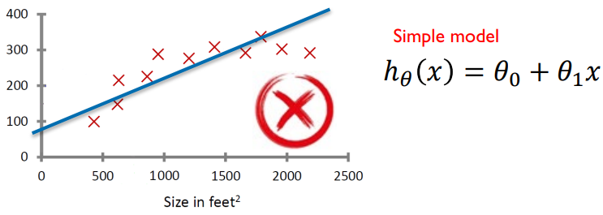
- 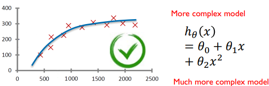
- - Just right
- - It fits the data pretty well
- **Overfitting**
- - The model has a high variance
- - Very poor performance on 
new data
- -  It does not generalize well
- 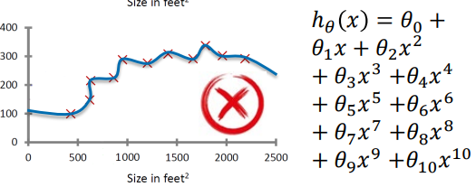
## The problem of overfitting - classification
- 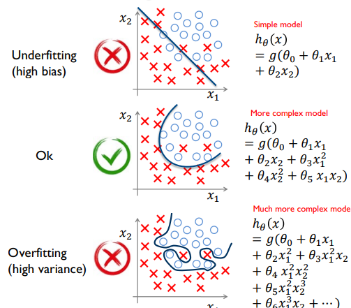
## The problem of overfitting
- 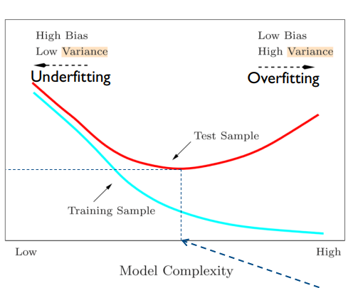
-  What makes it more likely
to overfit?
- - Not enough training
examples
- - Too many features
- - Using a non-convenient
type of models
## Generalization(khái quát) Error
- **The training error** is the error of the model $ℎ_𝜃$ on the training examples.
- **The generalization error** is the error of the model $ℎ_𝜃$ on new (unseen) data
- - **The generalization error** is **typically higher** than the **training error**
- How do we estimate the generalization error of some model?
- - Using k-fold Cross Validation (k-CV)
- - Using Leave-One-Out estimate (LOO)
- Example of k=5-fold cross validation:
- - Split the training dataset into 5 parts (folds).
- - Each time, train a model on the training
parts (green) and apply it on the
remaining part (blue) to estimate the error
- - So, you will finally get 5 estimates of the error. The generalization error is the average of these 5 errors. In the case of classification, you can also compute the  generalization accuracy(độ chính xác) the same way (accuracy% = 100 – error%) 
- 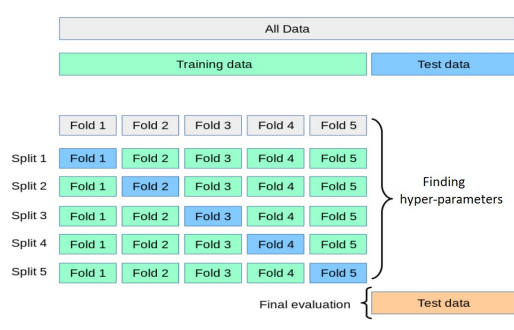
- Leave-one-out cross validation:
- -It is similar to the k-fold cross validation, but the training dataset is split into 𝑛 parts, where 𝑛 is the number of training samples. i.e., we leave one sample each time.
- It is useful when you have a small training dataset (i.e. when 𝑛𝑛 is small).
## 1. Addressing overfitting
- when we have more than 2 or 3 features.
1. Model selection / hyperparameters tuning 
2. Reducing the number of features
3. Using an ensemble methods
### Hyper-parameters Tuning
- Most ML algorithm has hyperparameters that lead to(dan toi) a more or less complex model.
- To find the values of hyperparameters that lead to a good model (not too simple, not too complex), we need to:
- - Pick some values for our hyperparameters.
- - Compute the generalization error using a 10-fold-cross-validation
- - Repeat steps 1 and 2
- - Keep the hyperparameters that gave you to the smallest generalization error; and train a model on the whole training set using those hyperparameters.
- - You can now test your trained model on the test data (see figure) to see how it will perform 
- 
### Comparing two models
- Suppose that you want to compare two regression algorithms A and B.
- when you performed a 10-fold-cross-validation on A and B, you got the following MSE error estimates:
- - For A: [0.6, 0.1, 1.1, 1.3, 0.3, 3.2, 3.2, 0.9, 1.3, 1.1] . The average is $𝜇_𝐴$ = 1.31. The stdev is $𝜎_𝐴$ = 1.01
- - For B: [3.3, 0.6, 5, 12.4, 1.2, 5.8, 8.6, 0.4, 0.5, 4.35]. The average is $𝜇_B$ = 4.21. The stdev is $𝜎_𝐴$ = 3.75
- Model A is better than model B  ($𝜇_𝐴$ < $𝜇_𝐵$).
- Is A significantly (dang ke)better than B?: To answer this question we need to do some statistical tests. One such test (Wilcoxon test) uses 
the standard deviations $𝜎_𝐴$, $𝜎_𝐵$ and compares the means $𝜇_𝐴$, $𝜇_𝐵$ to check if:
- 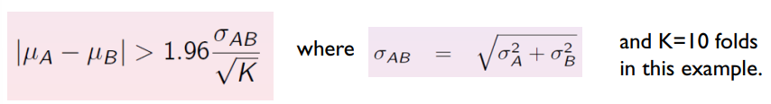
-> If true, then the results achieved by A and B are significantly different
## 2. Features Selection
### Motivation behind features selection
- Datasets with thousands or millions of features are quite usual( kha binh thuong) these days.
- Choose features are needed 
- 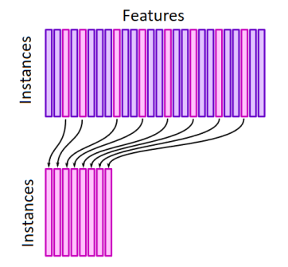
### Simple (naïve) feature selection
- Removing features with low variance:
- Suppose that we have a feature that have the same value in 
all samples (i.e. a column of 𝑋 which has a constant value)
- It doesn’t help differencing between samples.
-> Removed
### Recursive(de quy) feature elimination(loai bo)
- Suppose that we have a model that assigns(gans) weights to features
- $( h_\theta(x) = \theta_0 + \theta_1x_1 + \theta_2x_2 + \theta_3x_3 + \dots + \theta_d x_d )$
- We train a model using the initial set of features
- We obtain(hieu duoc) the importance of each feature
- We remove the least(its) important features from current set of features.
- We repeat this procedure(quy tirnh) recursively(de quy) until the desired(dat duoc) number of features to select is reached
- 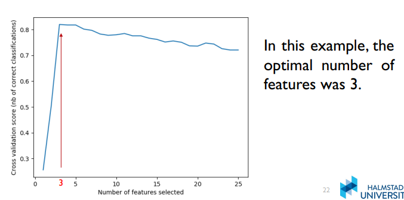
- Ban đầu, khi số lượng đặc trưng được chọn tăng lên, điểm số của mô hình cũng tăng lên nhanh chóng.
- Tuy nhiên, sau khi chọn khoảng 3 đặc trưng, điểm số đạt giá trị cao nhất (~0.8).
- Sau mốc này, khi thêm nhiều đặc trưng hơn (quá 3 đặc trưng), điểm số xác thực chéo bắt đầu giảm nhẹ hoặc không cải thiện đáng kể.
- Trong ví dụ này, số lượng đặc trưng tối ưu là 3 (được đánh dấu bằng màu đỏ), vì đây là mốc mà mô hình đạt được hiệu suất tốt nhất trước khi bắt đầu giảm sút hoặc ổn định.
- Việc chọn nhiều hơn 3 đặc trưng không giúp cải thiện độ chính xác, có thể dẫn đến hiện tượng overfitting.
### Tree-based feature selection
- Some classification or regression models such as tree-based models can be used to compute features importance
- This is can be used to discard irrelevant features.
## Ensemble(hoa tau) Methods
- Instead of using a single model, why not using several models at once.
- Diversity(da dang) vs accuracy(chinh xac):
- - An ensemble(quan the) of classifiers must be more accurate than any of its individual members
- - The individual classifiers composing an ensemble must be: better than random, diverse( phai co su khac biet ve du doan)
- 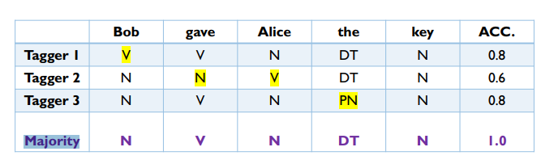
- There is no algorithm that is always the most accurate in all situations.
- Generate(tao ra) a group of base-learners which when combined has higher accuracy. 
- How do we generate a diverse set of base- learners (models) that complement(bo sung) each other?
- - using Bagging and Boosting
- - - • Generate new datasets by sampling from the original dataset 
uniformly at random (with replacement), and with different 
subsets of features …
- How do we combine(ket hop) the outputs of base learner for maximum accuracy?
Voting, Weighted combination of the outputs …
## Ensemble Methods: Random Forest
- Random forest is an ensemble(cung nhau) of decision trees
- 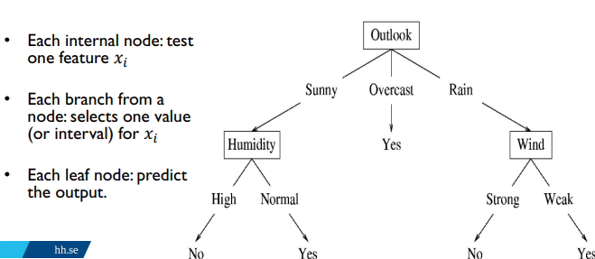
- Entropy = -$\sum_{i=1}^{c}p_{i} \log_{c} p_{i}$
- The homogeneity is measured using (e.g.) entropy
- - If a subset(tap hop con) is completely homogeneous(dong nhat) the entropy is zero.
- - If a subset is equally divided(chia) (has same proportion of different labels) then it has entropy of one
- Simplified Algorithm
- - Choose T : the number of trees in the ensemble.
- - Choose 𝑚' < m: 𝑚 is the number of total features, 𝑚′ is 
the number of features used to calculate the best split at each 
node (typically 20%).
- - Choose a training set
- - For each node, randomly choose m' features and calculate the best split
- Use majority voting among all the trees to predict
## VD1: Giả sử bạn có một tập dữ liệu với 5 học sinh, mỗi học sinh có 4 đặc trưng:

| Học sinh  | Thời gian học (giờ) | Số lần đến lớp | Số lần làm bài tập | Số buổi học thêm | Đã vượt qua kỳ thi? |
|-----------|---------------------|----------------|--------------------|------------------|---------------------|
| A         | 10                  | 20             | 5                  | 3                | Có                  |
| B         | 8                   | 18             | 3                  | 2                | Không               |
| C         | 12                  | 22             | 4                  | 4                | Có                  |
| D         | 6                   | 15             | 2                  | 1                | Không               |
| E         | 9                   | 19             | 4                  | 3                | Có                  |

## Thuật toán Random Forest:

- Chọn số lượng cây trong rừng **T**.
- Chọn số lượng đặc trưng sử dụng để tính toán điểm phân chia tốt nhất tại mỗi nút, gọi là **m'**, với điều kiện **m'** nhỏ hơn tổng số đặc trưng **m**.
- Lấy một tập huấn luyện ngẫu nhiên cho mỗi cây.
- Với mỗi nút, chọn ngẫu nhiên **m'** đặc trưng và tính toán điểm phân chia tốt nhất.
- Sử dụng **nguyên tắc đa số phiếu** trong tất cả các cây để dự đoán.

## Cây quyết định đơn giản trong rừng:
                       Thời gian học > 9?
                      /                    \
                   Có                      Không
                  /                          \
        Số lần đến lớp > 18?             Số buổi học thêm > 1?
        /               \                 /                \
      Có                 Không         Có                  Không
    Đã vượt qua       Không vượt qua   Đã vượt qua        Không vượt qua

## Kết quả dự đoán từ 100 cây trong Random Forest:

| Kết quả dự đoán | Số cây dự đoán |
|-----------------|----------------|
| Có              | 60             |
| Không           | 40             |

Kết quả cuối cùng là "Vượt qua kỳ thi" dựa trên đa số phiếu.
## Giả sử:
- **T** = 5 (số lượng cây trong rừng là 5)
- **𝑚** = 10 (tổng số đặc trưng)
- **𝑚'** = 3 (số đặc trưng được chọn ngẫu nhiên tại mỗi nút)

## Ví dụ 2 về các cây khác nhau trong rừng:

#### Cây 1:
- Tập đặc trưng ngẫu nhiên: **Tuổi**, **Thu nhập**, **Giới tính**.
- Cây này sẽ phân chia dựa trên các đặc trưng này và đưa ra dự đoán liệu khách hàng có mua sản phẩm hay không.

#### Cây 2:
- Tập đặc trưng ngẫu nhiên: **Lịch sử mua hàng**, **Khu vực**, **Số lượng sản phẩm đã mua**.
- Cây 2 có cấu trúc khác với cây 1 do sử dụng các đặc trưng và tập dữ liệu khác nhau.

#### Cây 3:
- Tập đặc trưng ngẫu nhiên: **Tuổi**, **Giới tính**, **Thu nhập**.
- Dự đoán có thể khác hoặc giống với cây 1 và 2 tùy vào cách phân chia dữ liệu.

#### Cây 4:
- Tập đặc trưng ngẫu nhiên: **Số lần tương tác với sản phẩm**, **Thu nhập**, **Giới tính**.

#### Cây 5:
- Tập đặc trưng ngẫu nhiên: **Tuổi**, **Lịch sử mua hàng**, **Khu vực**.

### Kết quả cuối cùng:
- Sau khi các cây đã hoàn thành dự đoán, kết quả sẽ được dựa trên **bỏ phiếu đa số** (majority voting). Nếu 3 trong số 5 cây dự đoán rằng khách hàng sẽ mua sản phẩm, thì dự đoán cuối cùng sẽ là **có**.

### Random Forest and Features Importance
- Random Forest can compute the importance of each feature. 
So, it can be used for feature selection.
- This is done using the-  mean decrease impurity(tap chat)
## Regularization
### Regularization - Motivation
- 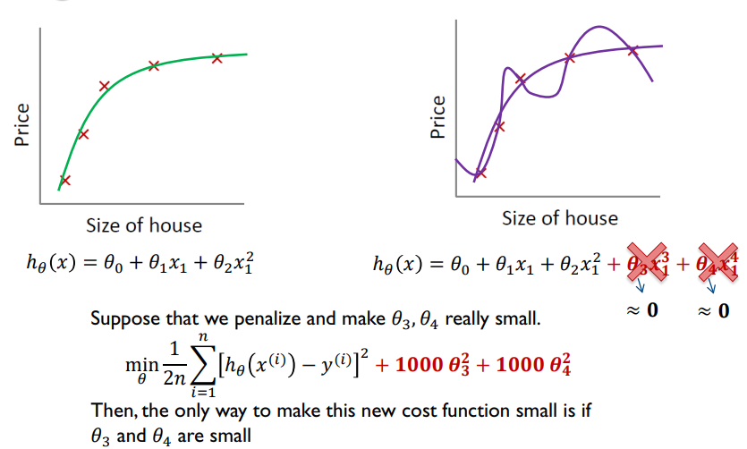
- Small values for parameters $𝜃_0$,$𝜃_1$, … , $𝜃_𝑝$
- - Implies a simpler hypothesis(gia thuyet don gian hon)
- -  Less prone to overfitting (giam overfitting)
- So we just modify our cost function as follows
- 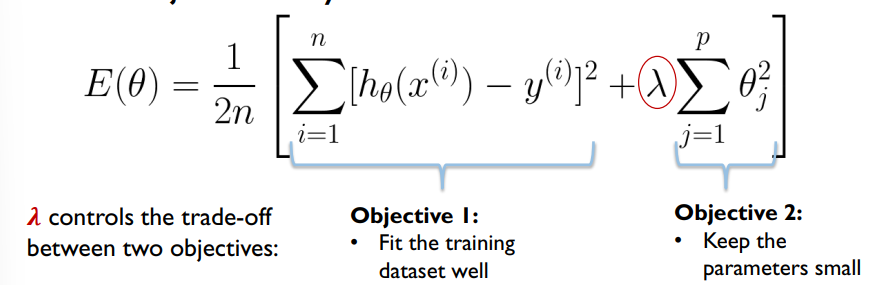
- What happens if 𝝀𝝀 is set to zero ?
- - This becomes our original cost function. **Overfitting** can happen.
- What happens if 𝝀𝝀 is set to an extremely large value?
- - The algorithm might result in **underfitting**.
- 
### Regularized Linear Regression
- 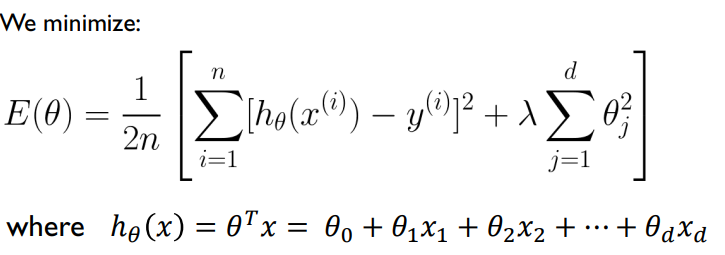
- By the way, how can you write 𝐸(𝜃𝜃) in a more compact way,using vectors/matrices
- 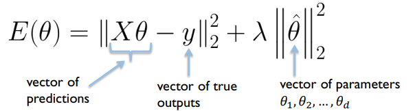
#### Gradient Descent
- 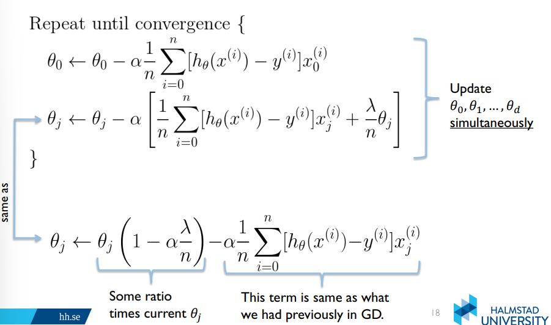
#### Normal equation
- 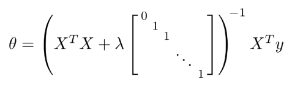
### Regularized Logistic Regression (for classification)
- 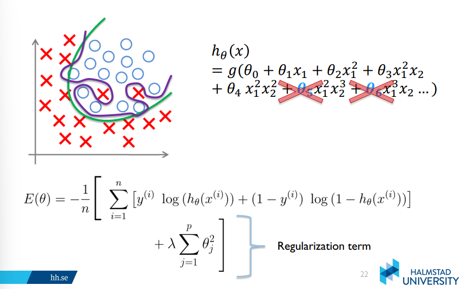
- 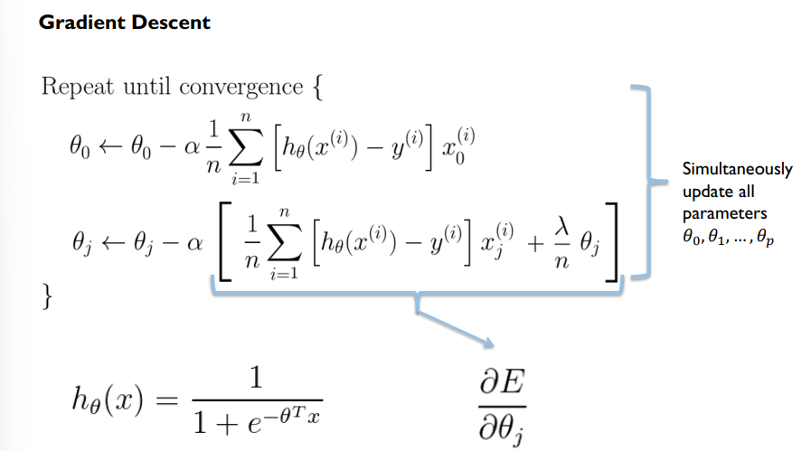