# Linear Regression
## Giới thiệu
- Một căn nhà rộng x1 m2, có x2 phòng ngủ và cách trung tâm thành phố x3 km có giá là bao nhiêu. Giả sử chúng ta đã có số liệu thống kê từ 1000 căn nhà trong thành phố đó, liệu rằng khi có một căn nhà mới với các thông số về diện tích, số phòng ngủ và khoảng cách tới trung tâm, chúng ta có thể dự đoán được giá của căn nhà đó không? Nếu có thì hàm dự đoán y=f(x) sẽ có dạng như thế nào. Ở đây x=[x1,x2,x3] là một vector hàng chứa thông tin input, y là một số vô hướng (scalar) biểu diễn output
- 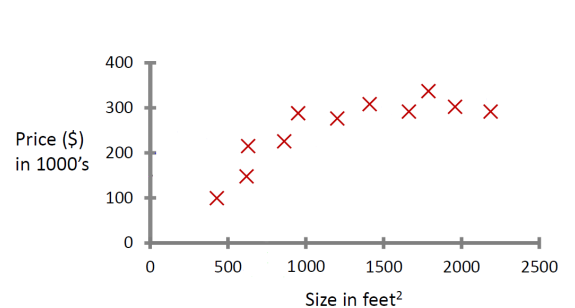
- Một hàm số đơn giản nhất có thể mô tả mối quan hệ giữa giá nhà và 3 đại lượng đầu vào là:

- $h(x) = \theta_1 x_1 + \theta_2 x_2 + \theta_3 x_3 + \theta_0$ ( 1 )
- $\theta_1$ , $\theta_2$ , $\theta_3$ , $\theta_0$  là các hằng số, w0 còn được gọi là bias. Bài toán đi tìm các hệ số tối ưu {$\theta_1$ ,$\theta_2$ ,$\theta_3$ ,$\theta_0$ }
- **Chú ý**: y
  là giá trị thực của outcome (dựa trên số liệu thống kê chúng ta có trong tập training data), trong khi $\hat{y}$ là giá trị mà mô hình Linear Regression dự đoán được
## Phân tích toán học
### Dạng của Linear Regression
- Trong phương trình (1) phía trên, nếu chúng ta đặt $\mathbf{\theta} = [\theta_0, \theta_1, \theta_2, \theta_3]^T $= là vector (cột) hệ số cần phải tối ưu
- $\mathbf{\bar{x}} = [1, x_1, x_2, x_3]$ là vecsto hàng
- Khi đó (1) trở thành: $ h \approx \mathbf{\bar{x}}\mathbf{\theta} = \hat{h}$
### Error Function
- $E(\theta_0, \theta_1, ...) = \frac{1}{2n} \sum_{i=1}^n [h_\theta(x^{(i)}) - h^{(i)}]^2$
- Để tìm các tham số giảm thiểu **Error Function**, chúng ta có thể sử dụng thuật toán tối ưu hóa có tên là: **Gradient Descent**
- **Gradient Descent** là một thuật toán tối ưu hóa chung, không chỉ dành riêng cho Error Function.
## Gradient Descent 
### Basic idea
1. Start with some values for the parameters $\theta_0$, $\theta_1$
2. Keep updating $\theta_0$, $\theta_1$ to reduce 𝐸($\theta_0$, $\theta_1$) until we hopefully end up at a minimum
- 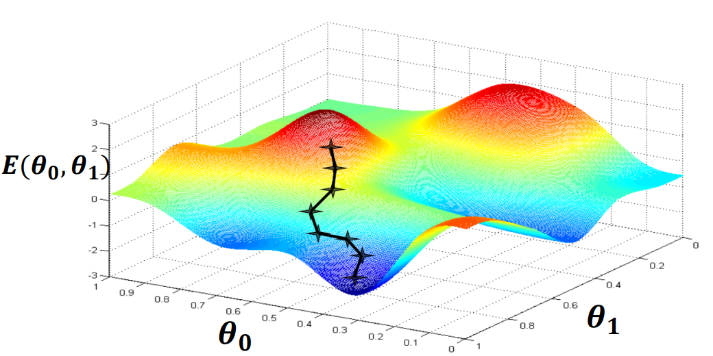
- Depending on initial(ban đầu) parameter values, we might end-up at a different (local) minimum
- 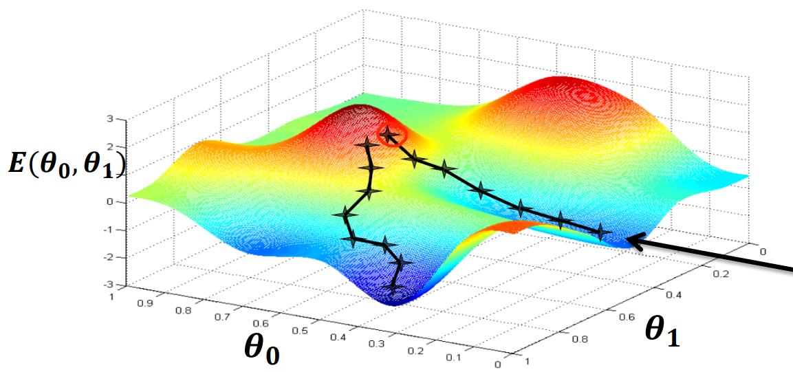
- At each update, how do we decide if we should increase or decrease each of the parameters ?
### Algorithm
- Pick some initial value for 𝜃1
- We want to update $\theta_1$ : θ₁ ← θ₁ - α ⋅ ∂E/∂θ₁
- **Derivative**: Looks at the slope(độ dốc) of the (red) line which is tangent (tiếp tuyến) to the function at that point.
- 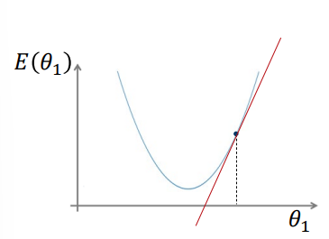
- **Positive slope**: In this case, since the derivative is positive and 𝛼 ≥ 0, then 𝜃1 will decrease, and get’s closer(gần tới) to the optimal (tối ưu) value.
- 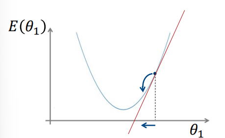
- **Negative slope**: In this case, since the derivative is negative and 𝛼 ≥ 0, then 𝜃1 will increase, and get’s closer to the optimal value.
- 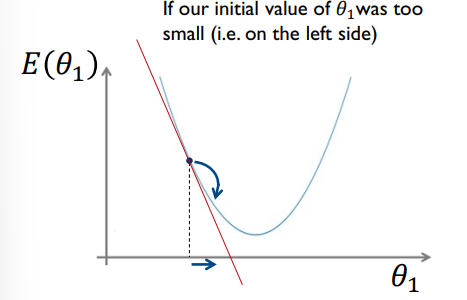
- **Reasonably small value of α**
- 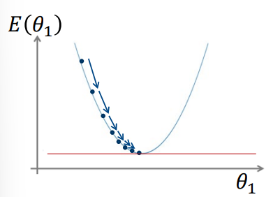
- Notice that as we approach a local minimum, gradient descent will automatically take smaller steps. So, no need to decrease 𝛼 over time
- **Very large value of α**
- 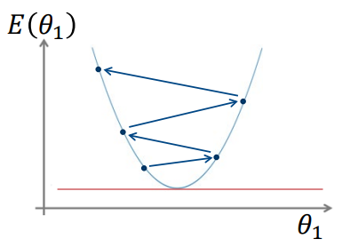
- If 𝛼 is too large, it may fail to 
converge (hội tụ), or may even diverge (phân kỳ).
### Local minimum
- 
## Using Gradient Descent for Linear Regression (with one feature)
- 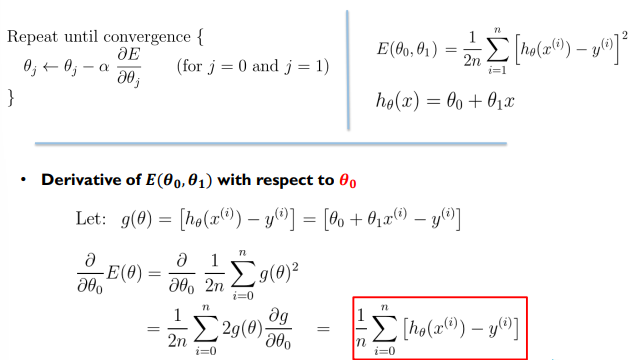
- 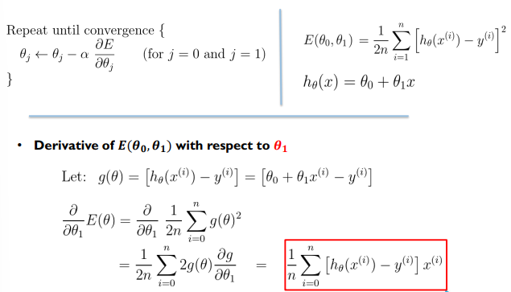
- 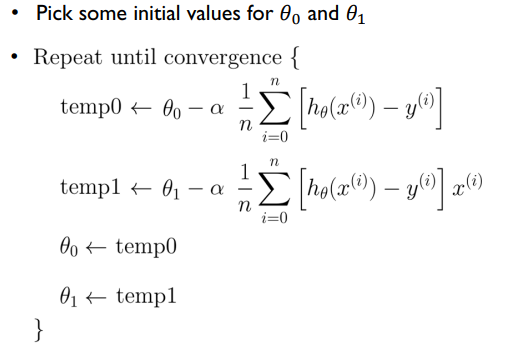
- **The batch gradient descent** uses all the
training examples, to update the model
parameters.
- **The online (also called stochastic)gradient** descent updates the model
parameters based on(dựa trên) one training example at a time(tại một thời điểm)
- **eg(1)** : you don’t have all the training dataset beforehand (trước). Your training examples arrive one by one (từng cái một) over time, as a stream (luồng).
- **e.g(2)**: your training dataset is very big (computationally expensive to use batch
GD, or the dataset doesn’t fit (vừa) in memory).
## Multivariate Linear Regression (with multiple features)
- 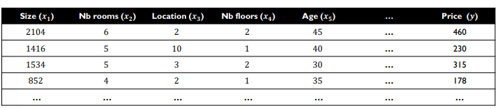
- $h_\theta(x)= \theta_1 x_1 + \theta_2 x_2 + \theta_3 x_3 + \theta_0$ 
- Define $x_0$=1
- 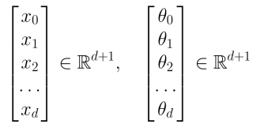
- $h_\theta(x) = \theta^T x$
- 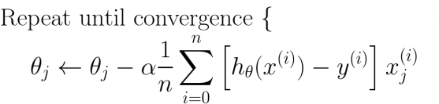
- 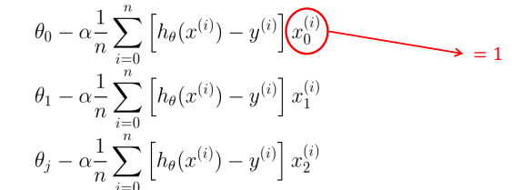
## Convergence and Select α
- For a sufficiently small(đủ nhỏ) 𝛼, the 𝐸(𝜃) (on the training set) should decrease at every iteration.
- One can consider convergence (thus stop)
if 𝐸(𝜃) decreases by less than 𝜖(small number e.g. 0.0001) in one iteration.
## Linear Regression with the Normal Equation
- Method to solve for 𝜃𝜃 analytically
- The derivative at the optimal point equals to 0. So, set the derivative to 0 
$\frac{\partial}{\partial \theta_j} E(\theta) = ... = 0$, and solve for $\theta_0$, … , 
- The solution will be: $\theta = (X^TX)^{-1}X^Ty$
## Gradient Descent vs. Normal Equation (for linear regression)
- 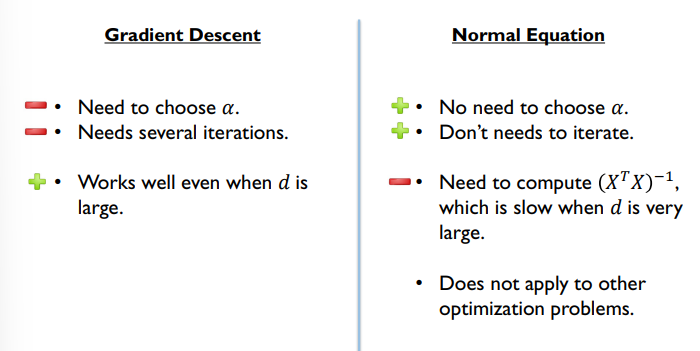
# Non-linear regression
- The output $h_\theta$ is a non-linear function
- Polynomial (Đa thức) function of degree(bậc) > 1
- 
- 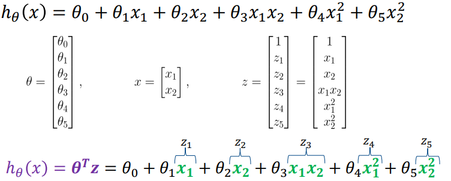
## Generalized(tổng quát) Linear Model for Non-linear Regression
- This can be seen as just creating and adding new features based on(dựa vào) the two original features 𝑥1, 𝑥2
- We can still find the parameters 𝜃 of the non-linear model (in 𝑥) using a linear model based on 𝑧.
- So, we can use the methods we studied previously(trước đây) in the linear regression lecture(bài giảng).
- It can be any kind of new features
- Requires a good guess of relevant features for your problem …
- Ví dụ: Giá nhà có thể không chỉ tăng tuyến tính với diện tích mà còn có thể tăng nhanh hơn hoặc chậm hơn tùy thuộc vào diện tích. Để mô hình hóa điều này, chúng ta có thể thêm các đặc trưng mới:
## K-Nearest-Neighbors (KNN) for Non-linear Regression
- KNN is a non-parametric model
-  This does not mean parameter-free (e.g. K is a hyper-parameters).
-  **Parametric**: we select a hypothesis(giả thuyết) space and adjust a fixed set of parameter using the training data.
-  **Non-parametric**: the model is not characterized(đặc trứng) by a fixed set of parameter
- KNN, we just save/memorize the training dataset (there is no training as such).
- To make a prediction on a new data-point 𝑥, we look at the 𝑘 most similar(tương tự) (i.e. closest/nearest) data-points from the training dataset. We can take:
- the **average output**(trung bình không trọng số) from these 𝑘 examples.
- **weighted average output**(trung bình có trọng số) from these 𝑘 examples.
- 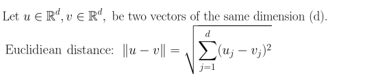
- 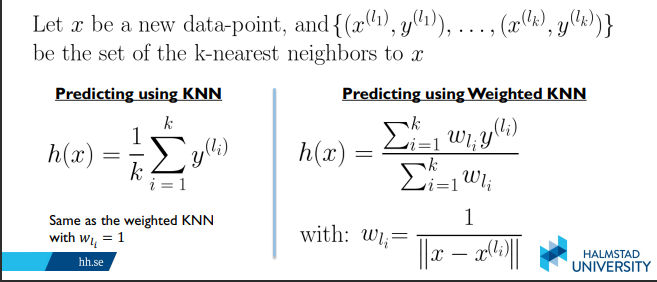
ví dụ:
- Giả sử bạn có tập dữ liệu huấn luyện với n=5 ví dụ và bạn sử dụng 𝑘=3:
## Ví dụ chi tiết về thuật toán KNN

**Tập dữ liệu huấn luyện:**
* Điểm 1: (x1, y1) = (1, 3)
* Điểm 2: (x2, y2) = (2, 5)
* Điểm 3: (x3, y3) = (3, 7)
* **Điểm cần dự đoán:** x_mới = 2.5

**Chọn k = 2**

### 1. Trung bình không trọng số
* **Các điểm gần nhất:** Điểm 2 và Điểm 3
* **Tính toán:**
- ŷ = (y2 + y3) / 2 = (5 + 7) / 2 = 6
- 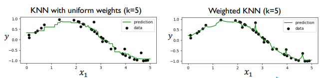
## Kernel Regression
-  Very similar to the weighted KNN method
- A common kernel regression model is the Nadaraya-Watson estimator, with a
**Gaussian kernel function**.
- 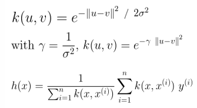
- 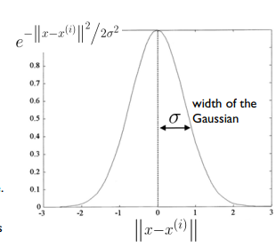
- Data-points closer to 𝑥 have a larger weight(trong so lon hon), i.e. influences(anh huong) the prediction more.
- Larger values of 𝜎 implies that more data-points will influence the prediction.(𝜎 lon nhieu diem du lieu anh huong den du doan)
- Too small 𝜎 may lead to overfitting(qua khop). Too large 𝜎 may lead to underfitting(chua khop du)
- Mô hình quá khớp: Không có điểm dữ liệu nào đủ gần để ảnh hưởng đáng kể đến dự đoán, dẫn đến một mô hình không thể dự đoán chính xác.
- Mô hình đạt chuẩn: Giá trị 𝜎 vừa phải giúp cân bằng giữa các điểm dữ liệu gần và xa, tạo ra một dự đoán chính xác và tổng quát hơn.
- Mô hình chưa khớp đủ: Giá trị 𝜎 quá lớn khiến mô hình không đủ nhạy với sự thay đổi của dữ liệu và dự đoán chỉ gần với trung bình của tất cả các giá trị.
## Features Normalization / Scaling
- Feature normalization is a preprocessing (tien xu li)step used to normalize(chuan hoa) the range(pham vi) of the features(tinh nang)
- It is important when the features have very different scales
- If one of the features has a broad range(khoang rong) of values, the distance will be governed(chi phoi) by this particular feature. Therefore, the range of all features should be 
normalized so that each feature contributes(gop phan) approximately(xap xo) proportionately(tuong ung) to the final distance. 
### Min-max Features scaling
- 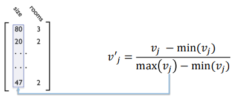
- These values will be ∈ [0, 1]
- 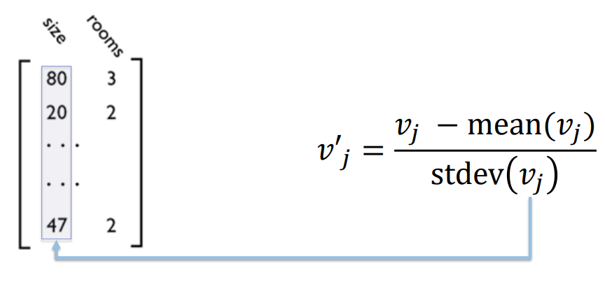
- 

