# Support Vector Machines (SVM)
## Intuition behind the SVM classifier
- 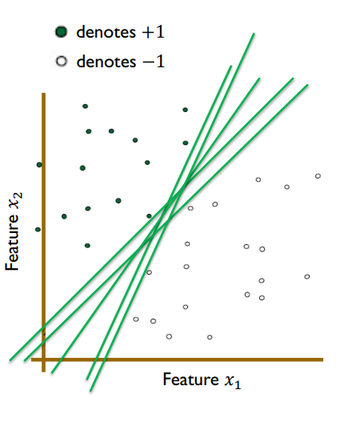
- That correctly classifies the training data-points
- There is an infinite number of such lines.
- But which one is best?
- 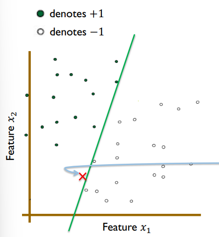
- Looks very similar to the points in the −1 class, but **misclassified** into the +1 class
- 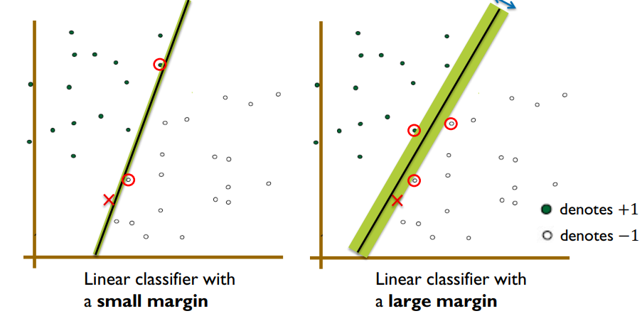
- Define the margin of a linear classifier as the width that the 
boundary could be increased by, before hitting a data point.
- 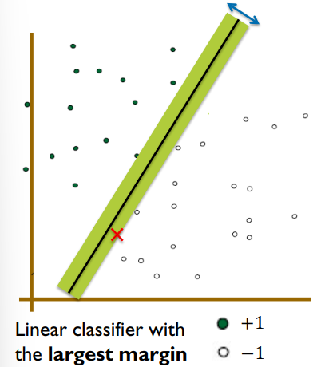
- The maximum margin linear classifier is the linear classifier with the **maximum margin**. **It is unique**
- 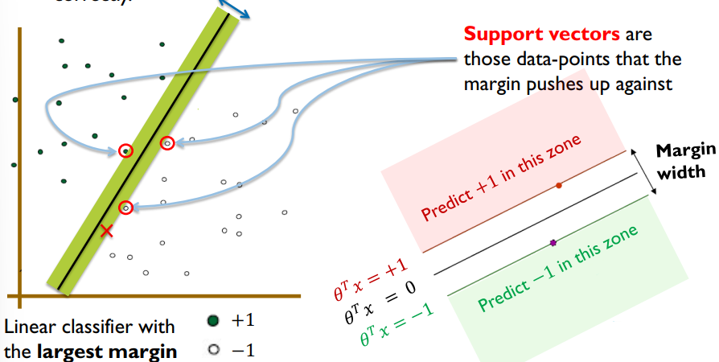
- This is the main principal behind the simplest version of SVM. It finds the hyperplane with the maximum margin, that separates the two classes correctly
## Defining the Optimization Problem for a Simple Linear SVM
### Simple Linear SVM Optimization Problem
- Two objectives:
  * Find the hyperplane with the largest margin 𝑴.
  * Hyperplane to correctly classify all training data-points.
- Find the hyperplane with the largest margin 𝑴
    * The margin area where -1 < θᵀ (𝑥) < +1 (in yellow) does not contain any training data-points.
   * Predict +1 for all data-points where θᵀ(𝑥) ≥ +1
   * Predict -1 for all data-points where θᵀ(x) ≤ -1
   * 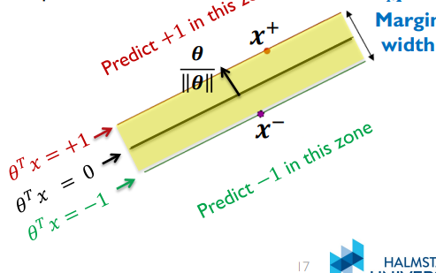
   * 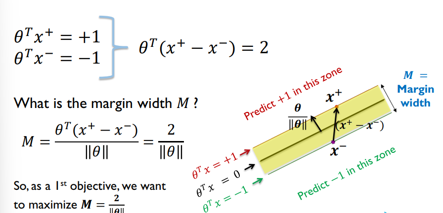
   * By choosing a parameter vector θ with θ ≈ 0, you will maximize this objective. But such θ wouldn’t be useful.
- The hyperplane to correctly classify all training data-points
   * 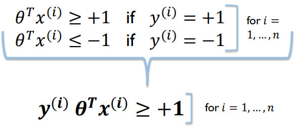
- So, our constrained optimization problem is:
   * 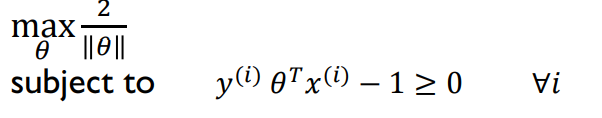
## Solving the Optimization Problem of the Simple SVM
- 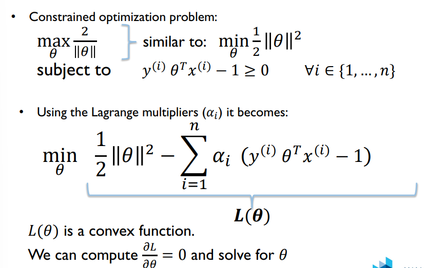
- 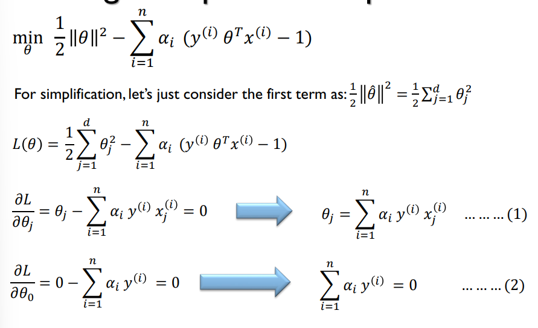
- By replacing (1) into 𝐿(𝜃) and considering (2) as a constraint(rang buoc), and solving the new optimization problem with respect to $𝛼_𝑖$, we can find the values of $𝛼_𝑖$ for 𝑖 = 0, … , n
- 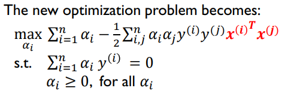
- Most of the $𝛼_𝑖$ will be equal to 0.
- Each non-zero $𝛼_𝑖$ indicates that the corresponding 𝑥(𝑖) is a support vector.
- 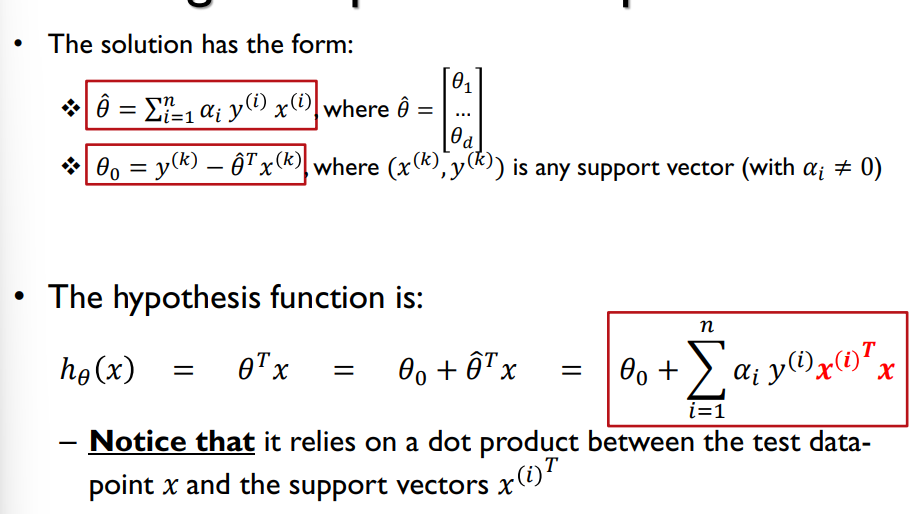

## SVM with soft margin
- Hard Margin:
   - where we required all training data-points to be classified correctly
- What if the training dataset is noisy, has outliers, or a hyperplane cannot correctly classify all the training data-points?
   - Soft margin: slack variables $𝜀_𝑖$ can be added to allow misclassification of difficult data-points (i.e. noise/outliers).
   - 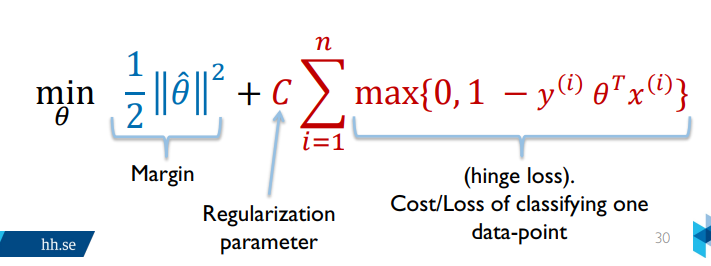
   - 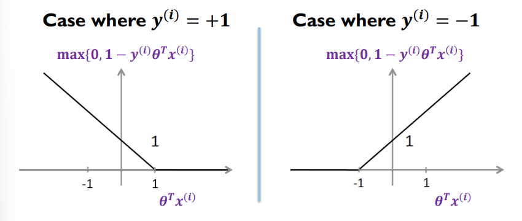
- Parameter 𝑪𝑪 can be viewed as a way to control overfittin
   - Trade-off between
      - Having a large margin
      - Classifying correctly
- 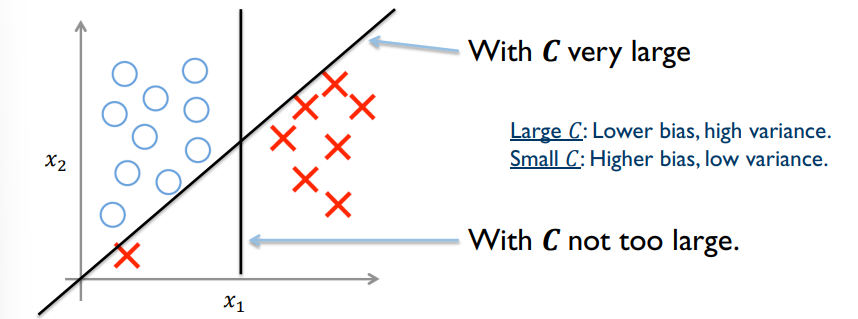
## Nonlinear SVM using Kernels
- In both these datasets, the two classes are not linearly separable(tach roi).
- 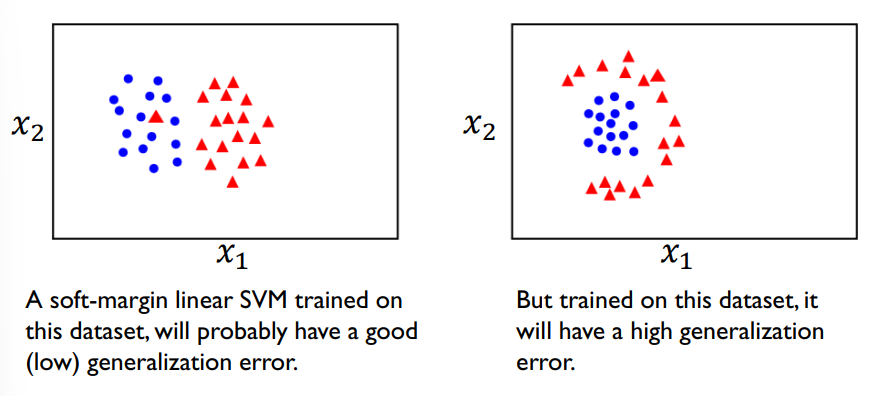
### Higher dimensional feature space
- General idea: the original feature space can always be mapped to some new higher-dimensional feature space where the classes are separable.
- Using a so called “kernel trick”, we can still use SVM without explicitly doing
this mapping, i.e. without explicitly computing the new data-points 𝑧(𝑖).
- 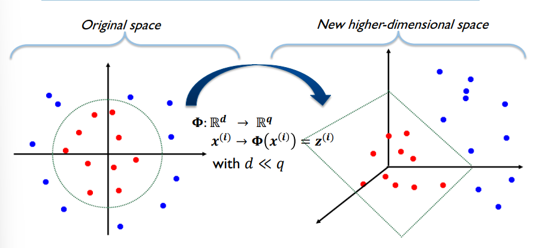
### Kernel function
- A **kernel function** 𝑘($𝑥^𝑖$
, $𝑥^j$
) is some function that corresponds to a dot
product between two vectors 𝑧(𝑖) = Φ($𝑥^𝑖$) and 𝑧($𝑥^j$) = Φ($𝑥^j$) in some
higher-dimensional feature space.
- A function 𝑘 of two vectors $𝑥^i$ and $𝑥^𝑗$ is a kernel function, if it can be written as the dot product between two new vectors
- 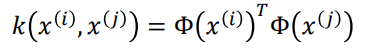
### Kernel trick
- 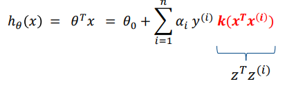
- SVM locates a separating hyperplane in the feature space and classifies points in that space.
- It does not need to represent the space explicitly, simply by defining a kernel function.
- The kernel function plays the role of the dot product in the feature space.
- 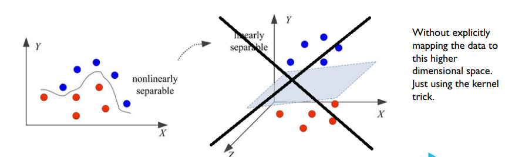